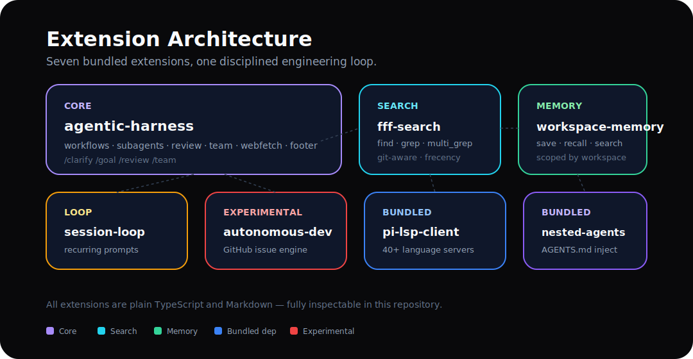
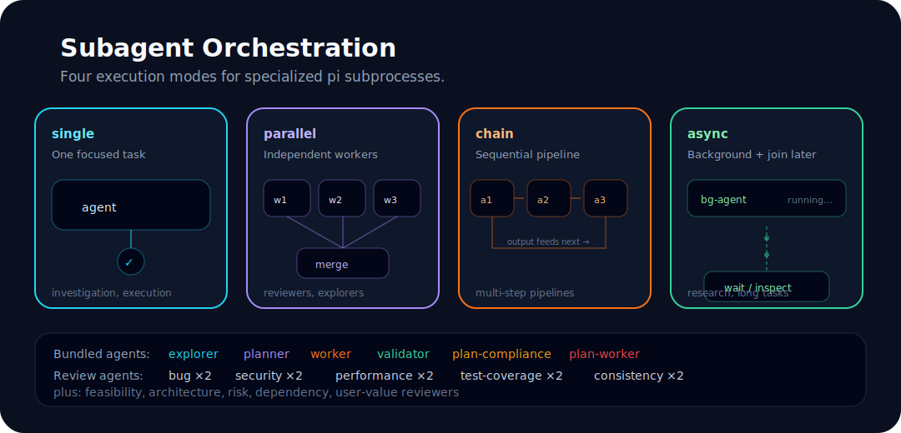
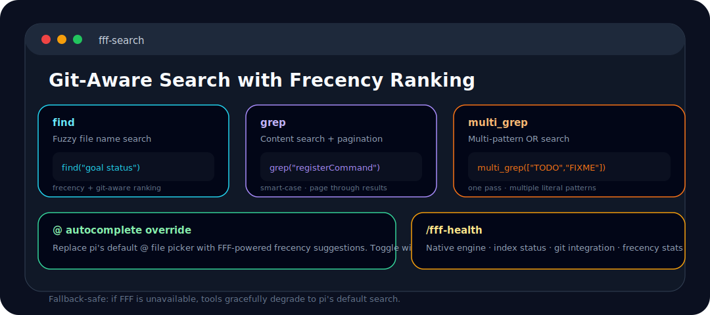
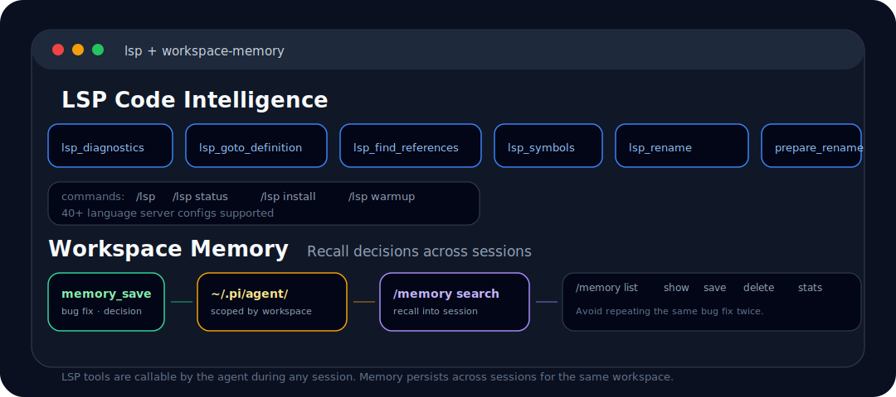

<p align="center">
  
</p>

<p align="center">
  <strong>Engineering discipline, agentic orchestration, and power-user tools for the pi coding agent.</strong>
</p>

<p align="center">
  <a href="CHANGELOG.md"></a>
  <a href="package.json"></a>
  <a href="https://github.com/badlogic/pi-mono"></a>
  <a href="https://www.typescriptlang.org"></a>
  <a href="package.json"></a>
</p>

<p align="center">
  Built on <a href="https://github.com/badlogic/pi-mono">pi</a>. Focused on transparent prompts, verifiable execution, subagents, code review, memory, LSP, and fast search.
</p>

---

## Table of Contents

- [What is ROACH PI?](#what-is-roach-pi)
- [Architecture](#architecture)
- [Installation](#installation)
- [Quick Start](#quick-start)
- [Clarify and Plan](#clarify-and-plan)
- [Subagent Orchestration](#subagent-orchestration)
- [Review Pipelines](#review-pipelines)
- [FFF Search](#fff-search)
- [LSP Code Intelligence](#lsp-code-intelligence)
- [Workspace Memory](#workspace-memory)
- [Session Loop](#session-loop)
- [Autonomous Dev](#autonomous-dev-experimental)
- [Nested AGENTS.md](#nested-agentsmd)
- [Commands Reference](#commands-reference)
- [Tools Reference](#tools-reference)
- [Configuration](#configuration)
- [Development](#development)
- [Contributing](#contributing)
- [License](#license)

---

## What is ROACH PI?

ROACH PI is an extension suite for the pi coding agent. It turns a normal coding session into a disciplined engineering loop:

<p align="center">
  
</p>

It is intentionally inspectable: commands, tools, hooks, agents, and skills are plain TypeScript and Markdown in this repository.

---

## Architecture

Seven bundled extensions, one disciplined engineering loop:

<p align="center">
  
</p>

---

## Installation

```bash
pi install git:github.com/tmdgusya/roach-pi
```

Restart `pi`, then run setup once:

```bash
/setup
```

`/setup` writes `quietStartup: true` to `~/.pi/agent/settings.json` so ROACH PI can own the startup banner instead of duplicating pi's default extension listing.

> [!WARNING]
> If you have the `superpowers` skill installed, remove it before using ROACH PI. It can define skill names that collide with this extension's bundled skills, and pi does not guarantee extension override order for duplicate skills.

---

## Quick Start

Try the disciplined path on a real task — from fuzzy idea to verified implementation in minutes:

```text
/clarify Add a feature that exports review results as Markdown
```

After the context brief is clear:

```text
/plan
```

Then ask the agent to run the plan through the execution loop:

```text
plan-compliance → plan-worker → plan-validator
```

Before merging non-trivial changes, run a review:

```text
/ultrareview
```

Quick system checks for visibility:

```text
/fff-health
/lsp status
/memory stats
```

---

## Clarify and Plan

Vague requests should not become vague code.

**`/clarify`** forces ambiguity into the open before implementation starts. It asks one focused question, offers concrete choices when useful, and explores relevant files with an `explorer` subagent in parallel.

The output is a **Context Brief** — a structured summary of the clarified scope, constraints, and affected files.

**`/plan`** then converts that brief into a task-by-task implementation plan with:
- explicit files to modify
- step-by-step instructions
- verification commands
- success criteria

Plan execution uses a **compliance → worker → validator** loop, so implementation and verification stay separated. Structured progress tracking records milestones, plan tasks, and todos as durable state — the footer reflects live `running` → `completed`/`failed` transitions and can restore progress from session replay.

| Command | Purpose |
|---|---|
| `/clarify [topic]` | Resolve ambiguity with dynamic questions and parallel exploration |
| `/plan [topic]` | Create an executable implementation plan |
| `/ultraplan [topic]` | Break complex work into milestones using five planning reviewers |
| `/reset-phase` | Clear active clarify/plan/ultraplan state |

---

## Subagent Orchestration

The `subagent` tool delegates work to specialized agents running as separate `pi` processes.

<p align="center">
  
</p>

Supported modes:

| Mode | Use it for |
|---|---|
| **Single** | One focused investigation or execution task |
| **Parallel** | Independent reviewers, explorers, or workers |
| **Chain** | Sequential pipelines where each step consumes the previous output |
| **Async** | Background tasks that can be waited on, checked, or interrupted by run id |

Async subagents support `asyncDependency: "needed-before-final"` when the lead agent must join results before finalizing its response.

---

## Review Pipelines

Two levels of review, one unified goal: catch problems before they ship.

**`/review`** — quick integrated review of a PR, branch, or local diff.

**`/ultrareview`** — the deep pass:

<p align="center">
  
</p>

1. resolve the diff once
2. dispatch 10 reviewers in parallel
3. run `reviewer-verifier` to dedupe and filter false positives
4. run `review-synthesis`
5. save the final report under `docs/engineering-discipline/reviews/`

| Command | Description |
|---|---|
| `/review [target]` | Quick single-pass review. Target can be omitted, PR number, PR URL, or branch |
| `/ultrareview [target]` | Deep 10-reviewer pipeline with verifier and synthesis report |

---

## FFF Search

The bundled FFF extension upgrades pi's file and content search with git-aware ranking and frecency.

<p align="center">
  
</p>

- **`find`** — fuzzy file name search with frecency and git-aware ranking
- **`grep`** — content search with pagination and smart-case behavior
- **`multi_grep`** — multi-pattern OR search in one pass
- **`@` autocomplete** — replace pi's default file picker with FFF suggestions (toggle with `/fff-mode both`)

FFF is fallback-safe: if the native engine is unavailable, tools gracefully degrade to pi's default search.

---

## LSP Code Intelligence

The bundled `pi-lsp-client` extension adds IDE-like operations directly inside pi sessions:

- `lsp_diagnostics` — errors, warnings, and hints
- `lsp_goto_definition` — jump to symbol definitions
- `lsp_find_references` — find all usages across the workspace
- `lsp_symbols` — document and workspace symbol search
- `lsp_prepare_rename` — check if a rename is safe
- `lsp_rename` — rename a symbol across the entire workspace

Supports **40+ language server configs** out of the box.

```text
/lsp              Open the LSP server inspector
/lsp status       Print installed/available language server summary
/lsp install <id> Run a whitelisted install recipe
/lsp warmup <id>  Preload a language server for the workspace
```

---

## Workspace Memory

<p align="center">
  
</p>

Workspace memory stores important findings as structured records under pi's agent directory, scoped by workspace. It recalls relevant records into future sessions automatically.

```text
/memory list           List all memories
/memory show <id>      Show a specific memory
/memory save <text>    Save a new memory
/memory delete <id>    Delete a memory
/memory search <query> Search memories
/memory stats          Show memory statistics
```

The LLM-callable `memory_save` tool is used after bug fixes, decisions, or useful discoveries — so the agent avoids repeating the same fixes.

---

## Session Loop

**`/loop`** schedules recurring prompts inside the current session — useful for health checks, monitoring, or continuous verification:

```text
/loop 5m check git status and report changes
/loop 30s verify the dev server is running on port 3000
```

Jobs are session-scoped, error-isolated, timeout-protected, and cleaned up on shutdown.

```text
/loop-list           List active loop jobs
/loop-stop [job-id]  Stop one loop job
/loop-stop-all       Stop all loop jobs
```

---

## Autonomous Dev (Experimental)

Set `PI_AUTONOMOUS_DEV=1` to enable the GitHub issue engine:

```bash
export PI_AUTONOMOUS_DEV=1
pi
```

```text
/autonomous-dev start owner/repo
/autonomous-dev status
/autonomous-dev poll
/autonomous-dev stop
```

The engine polls issues labeled `autonomous-dev:ready`, tracks progress in the footer/widget, asks for clarification when needed, and uses existing agents to implement work.

---

## Nested `AGENTS.md`

The bundled nested-agents extension injects nearby directory-level `AGENTS.md` files whenever the agent reads a file. This lets each subtree carry local conventions without forcing you to paste them into every prompt.

```text
/nested-agents           Toggle the nested AGENTS.md context widget
pi --no-nested-agents    Disable at startup
```

---

## Commands Reference

### Workflow

| Command | Description |
|---|---|
| `/clarify [topic]` | Resolve ambiguity with dynamic questions and parallel exploration |
| `/plan [topic]` | Create an executable implementation plan |
| `/ultraplan [topic]` | Break complex work into milestones using five planning reviewers |
| `/reset-phase` | Clear active clarify/plan/ultraplan state |

### Review

| Command | Description |
|---|---|
| `/review [target]` | Quick single-pass review (omit target, PR number, URL, or branch) |
| `/ultrareview [target]` | Deep 10-reviewer pipeline with verifier and synthesis report |

### Search, LSP, Memory

| Command | Description |
|---|---|
| `/fff-mode both\|tools-only` | Toggle FFF powering both tools and `@` autocomplete or tools only |
| `/fff-health` | Show FFF engine, index, git, and frecency status |
| `/fff-rescan` | Trigger an explicit FFF rescan |
| `/lsp` | Open the LSP server inspector |
| `/lsp status` | Print installed/available language server summary |
| `/lsp install <serverId>` | Run a whitelisted install recipe or show a manual hint |
| `/lsp warmup <serverId>` | Preload a language server for the workspace |
| `/memory ...` | Manage workspace memories (list, show, save, delete, search, stats) |
| `/loop <interval> <prompt>` | Schedule recurring prompts |
| `/loop-list` | List active loop jobs |
| `/loop-stop [job-id]` | Stop one loop job |
| `/loop-stop-all` | Stop all loop jobs |

### Setup and Experimental

| Command | Description |
|---|---|
| `/setup` / `/init` | Configure recommended settings (`quietStartup: true`) |
| `/team ...` | Optional bounded team runner (requires `PI_ENABLE_TEAM_MODE=1`) |
| `/autonomous-dev ...` | Experimental GitHub issue engine (requires `PI_AUTONOMOUS_DEV=1`) |
| `/nested-agents` | Toggle nested `AGENTS.md` context widget |
| `/ask` | Manual smoke test for `ask_user_question` |

---

## Tools Reference

| Tool | What it does |
|---|---|
| `ask_user_question` | Focused multiple-choice or free-text clarification questions |
| `subagent` | Specialized agents in single, parallel, chain, or async modes |
| `webfetch` | Fetch web pages and convert to Markdown with caching |
| `bash` | Sandboxed shell execution with optional approval policy |
| `find` | FFF-backed fuzzy file search |
| `grep` | FFF-backed content search with pagination |
| `multi_grep` | Multi-pattern OR content search |
| `memory_save` | Save structured workspace memories |
| `team` | Optional team orchestration (gated by `PI_ENABLE_TEAM_MODE=1`) |
| `lsp_*` | Diiagnostics, definitions, references, symbols, and rename |

---

## Configuration

### Recommended Startup

```jsonc
// ~/.pi/agent/settings.json
{
  "quietStartup": true
}
```

`/setup` writes this for you.

### FFF Search Mode

```bash
PI_FFF_MODE=both pi          # tools + @ autocomplete
PI_FFF_MODE=tools-only pi    # tools only
```

Or change it live:

```text
/fff-mode both
/fff-mode tools-only
```

### Team Mode

```bash
PI_ENABLE_TEAM_MODE=1 pi
```

Disabled by default. Exposes the `team` tool and makes `/team` functional.

### Autonomous Dev

```bash
PI_AUTONOMOUS_DEV=1 pi
PI_AUTONOMOUS_LOG_PATH=~/.pi/autonomous-dev.log pi
```

### Sandboxed Bash Approval

```bash
PI_SANDBOX_APPROVAL_MODE=ask pi      # ask before escalation
PI_SANDBOX_APPROVAL_MODE=always pi   # approve automatically
PI_SANDBOX_APPROVAL_MODE=deny pi     # block escalation
```

### LSP Configuration

Create project-local `.pi/lsp-client.json` or user-global `~/.pi/lsp-client.json`:

```jsonc
{
  "lsp": {
    "my-server": {
      "command": ["my-lsp", "--stdio"],
      "extensions": [".myext"]
    }
  }
}
```

---

## Repository Layout

```text
extensions/
  agentic-harness/     # workflows, subagents, review, team, webfetch, footer
  fff-search/          # FFF-backed find/grep/multi_grep and @ autocomplete
  session-loop/        # recurring session prompts
  workspace-memory/    # save/recall workspace memory
  autonomous-dev/      # experimental GitHub issue processor
docs/engineering-discipline/
  context/             # Context Briefs
  plans/               # implementation plans
  reviews/             # review outputs
assets/                # README visuals
```

Bundled package dependencies also include `pi-lsp-client` and `@code-yeongyu/pi-nested-agents-md`.

---

## Development

Install dependencies in the extension you are changing, then run that extension's tests and type checks:

```bash
npm --prefix extensions/agentic-harness install
npm --prefix extensions/agentic-harness test
npm --prefix extensions/agentic-harness run build
```

For a broader local sweep, repeat the same pattern per extension:

```bash
npm --prefix extensions/agentic-harness test && npm --prefix extensions/agentic-harness run build
npm --prefix extensions/fff-search test && npm --prefix extensions/fff-search run build
npm --prefix extensions/session-loop test && npm --prefix extensions/session-loop run build
npm --prefix extensions/workspace-memory test && npm --prefix extensions/workspace-memory run build
npm --prefix extensions/autonomous-dev test && npm --prefix extensions/autonomous-dev run build
```

There is no root `npm test` script in `package.json`; use the extension-level commands above.

---

## Contributing

See [CONTRIBUTING.md](CONTRIBUTING.md). For larger changes, prefer the same discipline the extension enforces: clarify the goal, write a plan, implement in small steps, and verify with tests or a focused manual check.

---

## License

MIT. The package metadata in [package.json](package.json) declares the license.
