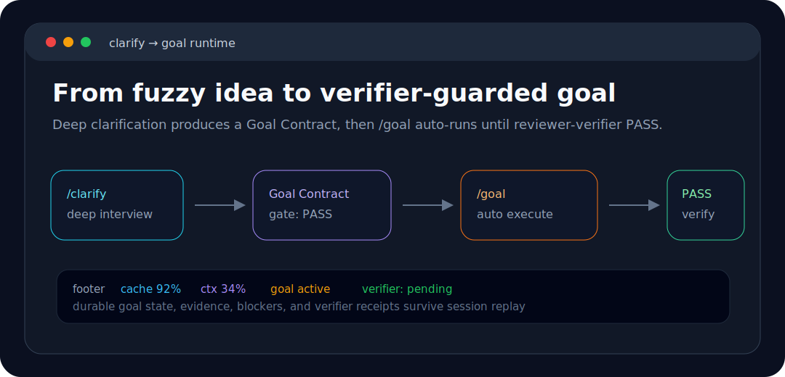

<p align="center">
  
</p>

<p align="center">
  <strong>Engineering discipline, agentic orchestration, and power-user tools for the pi coding agent.</strong>
</p>

<p align="center"><strong>Eight</strong> bundled extensions · <strong>MIT</strong> license · <strong>pi 0.72.x</strong> · <strong>40+</strong> language servers · <strong>TypeScript</strong></p>

<p align="center">
  <a href="CHANGELOG.md"></a>
  <a href="package.json"></a>
  <a href="https://github.com/badlogic/pi-mono"></a>
  <a href="https://www.typescriptlang.org"></a>
  <a href="package.json"></a>
</p>

<p align="center">
  Built on <a href="https://github.com/badlogic/pi-mono">pi</a>. Focused on transparent prompts, verifiable execution, subagents, code review, memory, LSP, MCP, and fast search.
</p>

---

## Table of Contents

- [What is Šváb Pi?](#what-is-svab-pi)
- [Architecture](#eight-extensions-one-loop)
- [Installation](#installation)
- [Quick Start](#quick-start)
- [Clarify and Goal](#clarify-then-goal)
- [Subagent Orchestration](#delegate-in-parallel)
- [Review](#catch-it-before-it-ships)
- [FFF Search](#search-git-aware)
- [LSP Code Intelligence](#lsp-code-intelligence)
- [MCP Adapter](#mcp-adapter)
- [Workspace Memory](#memory-that-recalls)
- [Session Loop](#loops-that-self-clean)
- [Nested AGENTS.md](#nested-agentsmd)
- [Code Previews](#previews-that-highlight)
- [Commands Reference](#commands-reference)
- [Tools Reference](#tools-reference)
- [Configuration](#configuration)
- [Development](#development)
- [Contributing](#contributing)
- [License](#license)

---

## What is _Šváb Pi_?

Šváb Pi is an extension suite for the pi coding agent. It turns a normal coding session into a disciplined engineering loop:

<p align="center">
  
</p>

It is intentionally inspectable: commands, tools, hooks, agents, and skills are plain TypeScript and Markdown in this repository.

---

## Eight extensions, _one loop_.

Eight bundled extensions, one disciplined engineering loop:

<p align="center">
  
</p>

---

## Installation

```bash
pi install git:github.com/portrik/svab-pi
```

Restart `pi`, then run setup once:

```bash
/setup
```

`/setup` writes `quietStartup: true` to `~/.pi/agent/settings.json` so Šváb Pi can own the startup banner instead of duplicating pi's default extension listing.

> [!WARNING]
> If you have the `superpowers` skill installed, remove it before using Šváb Pi. It can define skill names that collide with this extension's bundled skills, and pi does not guarantee extension override order for duplicate skills.

---

## Quick Start

Try the disciplined path on a real task — from fuzzy idea to verified implementation in minutes:

```text
/clarify Add a feature that exports review results as Markdown
```

After the Goal Contract is clear, run durable execution:

```text
/goal
```

The runtime creates/activates the goal, drives implementation, records evidence, requests verifier-guarded completion, and continues after verifier FAIL until PASS. Use `/goal status` only when you want to inspect state without starting work.

Before merging non-trivial changes, run a review:

```text
/review
```

Quick system checks for visibility:

```text
/fff-health
/lsp status
/memory stats
```

---

## Clarify, then _goal_.

Vague requests should not become vague code.

**`/clarify`** forces ambiguity into the open before implementation starts. It asks one focused question, offers concrete choices when useful, and explores relevant files with an `explorer` subagent in parallel.

The output is a **Goal Contract** — a structured summary of the objective, scope, constraints, success criteria, evidence required, risks, and suggested initial subgoals.

**`/goal`** owns durable execution. It tracks queued goals, active subgoals, evidence, blockers, verifier receipts, and automatic continuation. Completion is guarded by `reviewer-verifier`; a target cannot complete until the verifier returns PASS.

| Command | Purpose |
|---|---|
| `/clarify [topic]` | Resolve ambiguity with dynamic questions and parallel exploration |
| `/goal` | Auto-start or continue the durable goal runtime until verifier PASS |
| `/goal status` | Inspect active goal, subgoals, blockers, evidence, and next action |
| `/goal complete <targetId>` | Advanced: request verifier-guarded completion manually |
| `/reset-phase` | Clear active workflow phase |

---

## Delegate, in _parallel_.

The `subagent` tool delegates work to specialized agents running as separate `pi` processes.

<p align="center">
  
</p>

Supported modes:

| Mode | Use it for |
|---|---|
| **Single** | One focused investigation or execution task |
| **Parallel** | Independent reviewers, explorers, or workers |
| **Chain** | Sequential pipelines where each step consumes the previous output |
| **Async** | Background tasks that can be waited on, checked, or interrupted by run id |

Async subagents support `asyncDependency: "needed-before-final"` when the lead agent must join results before finalizing its response.

---

## Catch it, _before it ships_.

Catch problems before they ship.

**`/review`** — a quick, integrated single-pass review of a PR, branch, or local diff. It resolves the target (PR number, PR URL, branch name, or an auto-detected local diff), then streams findings across bugs, security, performance, test coverage, and consistency directly to chat. No subagents, no saved file — just fast feedback.

| Command | Description |
|---|---|
| `/review [target]` | Quick single-pass review. Target can be omitted, PR number, PR URL, or branch |

---

## Search, _git-aware_.

The bundled FFF extension upgrades pi's file and content search with git-aware ranking and frecency.

<p align="center">
  
</p>

- **`find`** — fuzzy file name search with frecency and git-aware ranking
- **`grep`** — content search with pagination and smart-case behavior
- **`multi_grep`** — multi-pattern OR search in one pass
- **`@` autocomplete** — replace pi's default file picker with FFF suggestions (toggle with `/fff-mode both`)

FFF is fallback-safe: if the native engine is unavailable, tools gracefully degrade to pi's default search.

---

## LSP Code Intelligence

The bundled `pi-lsp-client` extension adds IDE-like operations directly inside pi sessions:

- `lsp_diagnostics` — errors, warnings, and hints
- `lsp_goto_definition` — jump to symbol definitions
- `lsp_find_references` — find all usages across the workspace
- `lsp_symbols` — document and workspace symbol search
- `lsp_prepare_rename` — check if a rename is safe
- `lsp_rename` — rename a symbol across the entire workspace

Supports **40+ language server configs** out of the box.

```text
/lsp              Open the LSP server inspector
/lsp status       Print installed/available language server summary
/lsp install <id> Run a whitelisted install recipe
/lsp warmup <id>  Preload a language server for the workspace
```

---

## MCP Adapter

The bundled [pi-mcp-adapter](https://github.com/nicobailon/pi-mcp-adapter) extension gives pi access to MCP (Model Context Protocol) servers without burning the context window. Instead of registering hundreds of tool definitions upfront, a single proxy tool (~200 tokens) discovers and calls MCP tools on-demand.

```text
mcp({ search: "screenshot" })              # discover tools by keyword
mcp({ tool: "chrome_devtools_take_screenshot", args: '{"format": "png"}' })  # call a tool
```

Servers are **lazy by default** — they only connect when you actually use their tools, and disconnect after idle timeout. Specific tools can be promoted to first-class Pi tools via `directTools` config.

| Command | Description |
|---|---|
| `/mcp` | Interactive server panel with connection status and tool toggles |
| `/mcp setup` | Guided first-run setup (import existing configs, scaffold `.mcp.json`) |
| `/mcp tools` | List all available MCP tools |
| `/mcp reconnect [server]` | Connect or reconnect a server |
| `/mcp logout <server>` | Clear stored OAuth credentials |
| `/mcp-auth [server]` | OAuth authentication flow |

Configuration reads standard MCP files automatically: `~/.config/mcp/mcp.json`, `.mcp.json`, or Pi-specific overrides in `~/.pi/agent/mcp.json`.

---

## Memory that _recalls_.

<p align="center">
  
</p>

Workspace memory stores important findings as structured records under pi's agent directory, scoped by workspace. It recalls relevant records into future sessions automatically.

```text
/memory list           List all memories
/memory show <id>      Show a specific memory
/memory save <text>    Save a new memory
/memory delete <id>    Delete a memory
/memory search <query> Search memories
/memory stats          Show memory statistics
```

The LLM-callable `memory_save` tool is used after bug fixes, decisions, or useful discoveries — so the agent avoids repeating the same fixes.

---

## Loops that _self-clean_.

**`/loop`** schedules recurring prompts inside the current session — useful for health checks, monitoring, or continuous verification:

```text
/loop 5m check git status and report changes
/loop 30s verify the dev server is running on port 3000
```

Jobs are session-scoped, error-isolated, timeout-protected, and cleaned up on shutdown.

```text
/loop-list           List active loop jobs
/loop-stop [job-id]  Stop one loop job
/loop-stop-all       Stop all loop jobs
```

---

## Nested `AGENTS.md`

The bundled nested-agents extension injects nearby directory-level `AGENTS.md` files whenever the agent reads a file. This lets each subtree carry local conventions without forcing you to paste them into every prompt.

```text
/nested-agents           Toggle the nested AGENTS.md context widget
pi --no-nested-agents    Disable at startup
```

---

## Previews that _highlight_.

The bundled `pi-code-previews` extension renders syntax-highlighted previews for pi tool calls, so code and diffs in tool output read like an editor instead of plain text. Highlighting is powered by [shiki](https://shiki.style).

---

## Commands Reference

### Workflow

| Command | Description |
|---|---|
| `/clarify [topic]` | Resolve ambiguity with dynamic questions and parallel exploration |
| `/goal` | Auto-start or continue durable goal execution until verifier PASS |
| `/goal status` | Inspect durable goal runtime status |
| `/goal complete <targetId>` | Advanced: request verifier-guarded completion manually |
| `/reset-phase` | Clear active clarify/goal state |

### Review

| Command | Description |
|---|---|
| `/review [target]` | Quick single-pass review (omit target, PR number, URL, or branch) |

### Search, LSP, Memory

| Command | Description |
|---|---|
| `/fff-mode both\|tools-only` | Toggle FFF powering both tools and `@` autocomplete or tools only |
| `/fff-health` | Show FFF engine, index, git, and frecency status |
| `/fff-rescan` | Trigger an explicit FFF rescan |
| `/lsp` | Open the LSP server inspector |
| `/lsp status` | Print installed/available language server summary |
| `/lsp install <serverId>` | Run a whitelisted install recipe or show a manual hint |
| `/lsp warmup <serverId>` | Preload a language server for the workspace |
| `/memory ...` | Manage workspace memories (list, show, save, delete, search, stats) |
| `/loop <interval> <prompt>` | Schedule recurring prompts |
| `/loop-list` | List active loop jobs |
| `/loop-stop [job-id]` | Stop one loop job |
| `/loop-stop-all` | Stop all loop jobs |

### MCP

| Command | Description |
|---|---|
| `/mcp` | Interactive MCP server panel |
| `/mcp setup` | Guided first-run setup |
| `/mcp tools` | List all MCP tools |
| `/mcp reconnect [server]` | Connect or reconnect a server |
| `/mcp logout <server>` | Clear stored OAuth credentials |
| `/mcp-auth [server]` | OAuth authentication flow |

### Setup and Experimental

| Command | Description |
|---|---|
| `/setup` / `/init` | Configure recommended settings (`quietStartup: true`) |
| `/team ...` | Optional bounded team runner (requires `PI_ENABLE_TEAM_MODE=1`) |
| `/nested-agents` | Toggle nested `AGENTS.md` context widget |
| `/ask` | Manual smoke test for `ask_user_question` |

---

## Tools Reference

| Tool | What it does |
|---|---|
| `ask_user_question` | Focused multiple-choice or free-text clarification questions |
| `subagent` | Specialized agents in single, parallel, chain, or async modes |
| `webfetch` | Fetch web pages and convert to Markdown with caching |
| `bash` | Sandboxed shell execution with optional approval policy |
| `find` | FFF-backed fuzzy file search |
| `grep` | FFF-backed content search with pagination |
| `multi_grep` | Multi-pattern OR content search |
| `memory_save` | Save structured workspace memories |
| `team` | Optional team orchestration (gated by `PI_ENABLE_TEAM_MODE=1`) |
| `lsp_*` | Diagnostics, definitions, references, symbols, and rename |
| `mcp` | MCP proxy — search, describe, and call MCP server tools |

---

## Configuration

### Recommended Startup

```jsonc
// ~/.pi/agent/settings.json
{
  "quietStartup": true
}
```

`/setup` writes this for you.

### FFF Search Mode

```bash
PI_FFF_MODE=both pi          # tools + @ autocomplete
PI_FFF_MODE=tools-only pi    # tools only
```

Or change it live:

```text
/fff-mode both
/fff-mode tools-only
```

### Team Mode

```bash
PI_ENABLE_TEAM_MODE=1 pi
```

Disabled by default. Exposes the `team` tool and makes `/team` functional.


### Sandboxed Bash Approval

```bash
PI_SANDBOX_APPROVAL_MODE=ask pi      # ask before escalation
PI_SANDBOX_APPROVAL_MODE=always pi   # approve automatically
PI_SANDBOX_APPROVAL_MODE=deny pi     # block escalation
```

### LSP Configuration

Create project-local `.pi/lsp-client.json` or user-global `~/.pi/lsp-client.json`:

```jsonc
{
  "lsp": {
    "my-server": {
      "command": ["my-lsp", "--stdio"],
      "extensions": [".myext"]
    }
  }
}
```

---

## Repository Layout

```text
extensions/
  agentic-harness/     # workflows, subagents, review, team, webfetch, footer
  fff-search/          # FFF-backed find/grep/multi_grep and @ autocomplete
  session-loop/        # recurring session prompts
  workspace-memory/    # save/recall workspace memory
  pi-code-previews/    # syntax-highlighted tool-call previews (shiki)
docs/engineering-discipline/
  context/             # Context Briefs
  plans/               # implementation plans
  reviews/             # review outputs
assets/                # README visuals
```

Bundled package dependencies also include `pi-lsp-client`, `pi-mcp-adapter`, `@code-yeongyu/pi-nested-agents-md`, and `shiki` (powering `pi-code-previews`).

---

## Development

Install dependencies in the extension you are changing, then run that extension's tests and type checks:

```bash
npm --prefix extensions/agentic-harness install
npm --prefix extensions/agentic-harness test
npm --prefix extensions/agentic-harness run build
```

For a broader local sweep, repeat the same pattern per extension:

```bash
npm --prefix extensions/agentic-harness test && npm --prefix extensions/agentic-harness run build
npm --prefix extensions/fff-search test && npm --prefix extensions/fff-search run build
npm --prefix extensions/session-loop test && npm --prefix extensions/session-loop run build
npm --prefix extensions/workspace-memory test && npm --prefix extensions/workspace-memory run build
npm --prefix extensions/pi-code-previews test && npm --prefix extensions/pi-code-previews run check
```

`pi-code-previews` exposes `check` (typecheck + lint + format) instead of `build`; the rest expose `build` (`tsc --noEmit`).

There is no root `npm test` script in `package.json`; use the extension-level commands above.

---

## Contributing

See [CONTRIBUTING.md](CONTRIBUTING.md). For larger changes, prefer the same discipline the extension enforces: clarify the goal, write a plan, implement in small steps, and verify with tests or a focused manual check.

---

## License

MIT. The package metadata in [package.json](package.json) declares the license.
