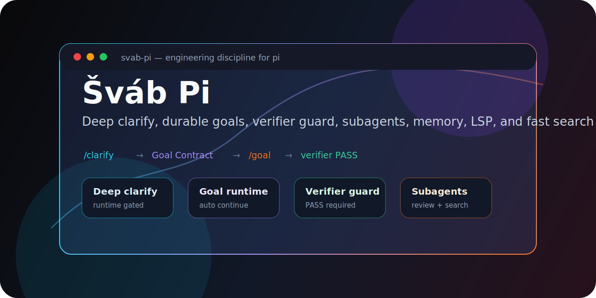
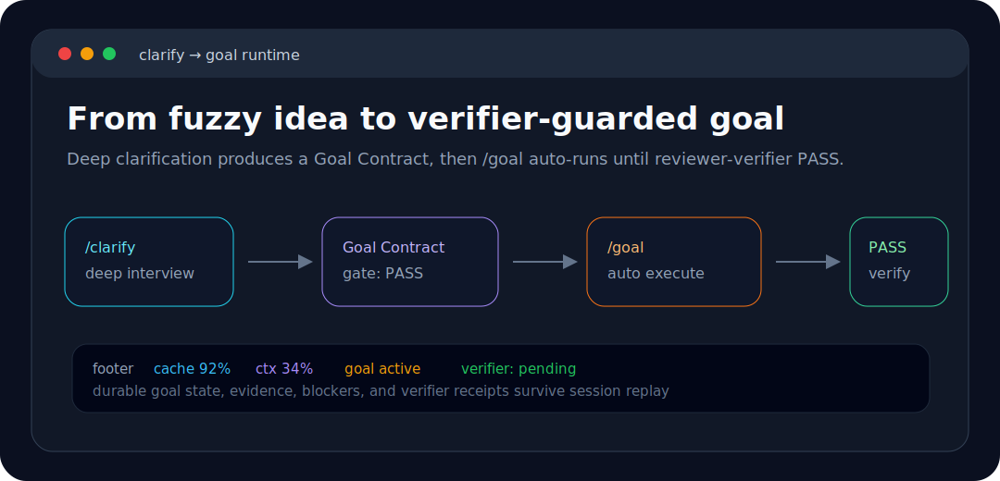

<p align="center">
  
</p>

<p align="center">
  <strong>Engineering discipline, agentic orchestration, and power-user tools for the pi coding agent.</strong>
</p>

<p align="center">
  <a href="CHANGELOG.md"></a>
  <a href="package.json"></a>
  <a href="https://github.com/badlogic/pi-mono"></a>
  <a href="https://www.typescriptlang.org"></a>
  <a href="package.json"></a>
</p>

<p align="center">
  Built on <a href="https://github.com/badlogic/pi-mono">pi</a>. Focused on transparent prompts, verifiable execution, subagents, code review, memory, LSP, and fast search.
</p>

---

## Table of Contents

- [What is ROACH PI?](#what-is-roach-pi)
- [Highlights](#highlights)
- [Installation](#installation)
- [First 15 Minutes](#first-15-minutes)
- [Feature Tour](#feature-tour)
- [Commands](#commands)
- [Tools](#tools)
- [Configuration](#configuration)
- [Development](#development)
- [Contributing](#contributing)
- [License](#license)

## What is ROACH PI?

ROACH PI is an extension suite for the pi coding agent. It turns a normal coding session into a disciplined engineering loop:

1. clarify ambiguous requests with focused questions,
2. turn the clarified goal into an executable plan,
3. dispatch specialized subagents to implement and verify work,
4. run deep review pipelines before merging,
5. preserve hard-won lessons in workspace memory.

It is intentionally inspectable: commands, tools, hooks, agents, and skills are plain TypeScript and Markdown in this repository.

## Highlights

### Agentic workflow discipline

- `/clarify` asks one context-aware question at a time and explores the codebase in parallel.
- `/plan` turns the clarified scope into a concrete implementation plan.
- Plan execution uses a compliance → worker → validator loop, so implementation and verification stay separated.
- Structured progress tracking records milestones, plan tasks, and todos as durable state; the footer now reflects live `running` → `completed`/`failed` task transitions and can restore progress from structured session replay events.

### Subagents and review fleets

- `subagent` runs specialized pi subprocesses in single, parallel, or chain mode.
- Async subagents can run in the background, declare when their answer is needed before the final response, and be waited on, inspected, or interrupted later by run id.
- `/ultrareview` dispatches 10 independent reviewers, then verifies and synthesizes the findings.
- Optional team mode can coordinate bounded worker batches with durable run state and tmux-backed panes.

### Faster navigation and safer edits

- FFF-backed `find`, `grep`, and `multi_grep` replace default search with git-aware ranking; `grep` and `multi_grep` also support pagination.
- Bundled LSP tools provide diagnostics, definitions, references, symbols, and workspace rename.
- Nested `AGENTS.md` injection gives the model local directory rules when it reads files.
- Sandboxed bash approval can block or ask before sensitive shell execution.

### Memory and autonomous operations

- Workspace memory recalls prior decisions, bug fixes, and lessons in future related sessions.
- `/loop` schedules recurring prompts such as health checks or status monitoring.
- Experimental autonomous-dev mode can poll labeled GitHub issues and work them through an agentic pipeline.

<p align="center">
  
</p>

## Installation

```bash
pi install git:github.com/tmdgusya/roach-pi
```

Restart `pi`, then run setup once:

```bash
/setup
```

`/setup` writes `quietStartup: true` to `~/.pi/agent/settings.json` so ROACH PI can own the startup banner instead of duplicating pi's default extension listing.

> [!WARNING]
> If you have the `superpowers` skill installed, remove it before using ROACH PI. It can define skill names that collide with this extension's bundled skills, and pi does not guarantee extension override order for duplicate skills.

## First 15 Minutes

Try the disciplined path on a real task:

```text
/clarify Add a feature that exports review results as Markdown
```

After the context brief is clear:

```text
/plan
```

Then ask the agent to run the plan. The intended execution pattern is:

```text
plan-compliance → plan-worker → plan-validator
```

Before merging non-trivial changes, run one of the review commands:

```text
/review
/ultrareview
```

Use the quick system checks when you need visibility:

```text
/fff-health
/lsp status
/memory stats
```

## Feature Tour

### 1. Clarification and planning

ROACH PI is built around the idea that vague requests should not become vague code. `/clarify` forces ambiguity into the open before implementation starts. It asks one focused question, offers concrete choices when useful, and explores relevant files with an `explorer` subagent in parallel.

The output is a Context Brief. `/plan` then converts that brief into a task-by-task implementation plan with explicit files, steps, verification commands, and success criteria.

### 2. Subagent orchestration

The `subagent` tool delegates work to specialized agents running as separate `pi` processes.

Supported modes:

| Mode | Use it for |
|---|---|
| Single | One focused investigation or execution task. |
| Parallel | Independent reviewers, explorers, or workers. |
| Chain | Sequential pipelines where each step consumes the previous output. |
| Async | Background tasks that can be waited on, checked, or interrupted by run id. Use `asyncDependency: "needed-before-final"` when the lead must join before finalizing. |

Bundled agents include `explorer`, `planner`, `worker`, `plan-compliance`, `plan-worker`, `plan-validator`, reviewer agents for feasibility/architecture/risk/dependency/user value, and review agents for bugs/security/performance/test coverage/consistency.

### 3. Review pipelines

`/review` is a quick integrated review of a PR, branch, or local diff. `/ultrareview` is the deep pass:

1. resolve the diff once,
2. dispatch 10 reviewers in parallel,
3. run `reviewer-verifier` to dedupe and filter false positives,
4. run `review-synthesis`,
5. save the final report under `docs/engineering-discipline/reviews/`.

<p align="center">
  
</p>

### 4. FFF search

The bundled FFF extension upgrades pi's file and content search:

- `find` fuzzy-searches file names with frecency and git-aware ranking.
- `grep` searches content with pagination and smart-case behavior.
- `multi_grep` searches multiple literal patterns in one pass.
- `@` file autocomplete can be replaced with FFF suggestions in `both` mode.

### 5. LSP code intelligence

The bundled `pi-lsp-client` extension adds IDE-like operations:

- `lsp_diagnostics`
- `lsp_goto_definition`
- `lsp_find_references`
- `lsp_symbols`
- `lsp_prepare_rename`
- `lsp_rename`

It supports 40+ language server configs and provides `/lsp`, `/lsp status`, `/lsp install <serverId>`, and `/lsp warmup <serverId>`.

### 6. Workspace memory

Workspace memory stores important findings as structured records under pi's agent directory, scoped by workspace. It can recall relevant records into future sessions and exposes:

```text
/memory list
/memory show <id>
/memory save <text>
/memory delete <id>
/memory search <query>
/memory stats
```

The LLM-callable `memory_save` tool is used after bug fixes, decisions, or useful discoveries.

### 7. Session loop

`/loop` schedules recurring prompts inside the current session:

```text
/loop 5m check git status and report changes
/loop 30s verify the dev server is running on port 3000
/loop-list
/loop-stop-all
```

Jobs are session-scoped, error-isolated, timeout-protected, and cleaned up on shutdown.

### 8. Autonomous dev engine experimental

Set `PI_AUTONOMOUS_DEV=1` to enable `/autonomous-dev`:

```bash
export PI_AUTONOMOUS_DEV=1
pi
```

```text
/autonomous-dev start owner/repo
/autonomous-dev status
/autonomous-dev poll
/autonomous-dev stop
```

The engine polls issues labeled `autonomous-dev:ready`, tracks progress in the footer/widget, asks for clarification when needed, and uses existing agents to implement work.

### 9. Nested `AGENTS.md`

The bundled nested-agents extension injects nearby directory-level `AGENTS.md` files whenever the agent reads a file. This lets each subtree carry local conventions without forcing you to paste them into every prompt.

```text
/nested-agents
pi --no-nested-agents
```

## Commands

### Workflow

| Command | Description |
|---|---|
| `/clarify [topic]` | Resolve ambiguity with dynamic questions and parallel exploration. |
| `/plan [topic]` | Create an executable implementation plan. |
| `/ultraplan [topic]` | Break complex work into milestones using five planning reviewers. |
| `/reset-phase` | Clear active clarify/plan/ultraplan state. |

### Review

| Command | Description |
|---|---|
| `/review [target]` | Quick single-pass review. Target can be omitted, PR number, PR URL, or branch. |
| `/ultrareview [target]` | Deep 10-reviewer pipeline with verifier and synthesis report. |

### Search, LSP, memory, and loops

| Command | Description |
|---|---|
| `/fff-mode both\|tools-only` | Choose whether FFF powers both tools and `@` autocomplete or tools only. |
| `/fff-health` | Show FFF native engine, index, git, and frecency status. |
| `/fff-rescan` | Trigger an explicit FFF rescan. |
| `/lsp` | Open the LSP server inspector. |
| `/lsp status` | Print installed/available language server summary. |
| `/lsp install <serverId>` | Run a whitelisted install recipe or show a manual hint. |
| `/lsp warmup <serverId>` | Preload a language server for the workspace. |
| `/memory ...` | Manage workspace memories. |
| `/loop <interval> <prompt>` | Schedule recurring prompts. |
| `/loop-list` | List active loop jobs. |
| `/loop-stop [job-id]` | Stop one loop job. |
| `/loop-stop-all` | Stop all loop jobs. |

### Setup and experimental modes

| Command | Description |
|---|---|
| `/setup` / `/init` | Configure recommended settings, currently `quietStartup: true`. |
| `/team ...` | Optional bounded team runner. Requires `PI_ENABLE_TEAM_MODE=1`. |
| `/autonomous-dev ...` | Experimental GitHub issue engine. Requires `PI_AUTONOMOUS_DEV=1`. |
| `/nested-agents` | Toggle nested `AGENTS.md` context widget. |
| `/ask` | Manual smoke test for `ask_user_question`. |

## Tools

| Tool | What it does |
|---|---|
| `ask_user_question` | Lets the agent ask focused multiple-choice or free-text clarification questions. |
| `subagent` | Runs specialized agents in single, parallel, chain, or async modes. |
| `webfetch` | Fetches web pages and converts them to Markdown with caching. |
| `bash` | Sandboxed shell execution with optional approval policy. |
| `find` | FFF-backed fuzzy file search. |
| `grep` | FFF-backed content search with pagination. |
| `multi_grep` | Multi-pattern OR content search. |
| `memory_save` | Saves structured workspace memories. |
| `team` | Optional team orchestration tool gated by `PI_ENABLE_TEAM_MODE=1`. |
| `lsp_*` | Diagnostics, definitions, references, symbols, and rename. |

## Configuration

### Recommended startup

```jsonc
// ~/.pi/agent/settings.json
{
  "quietStartup": true
}
```

`/setup` writes this for you.

### FFF search mode

```bash
PI_FFF_MODE=both pi          # tools + @ autocomplete
PI_FFF_MODE=tools-only pi    # tools only
```

Or change it live:

```text
/fff-mode both
/fff-mode tools-only
```

### Team mode

```bash
PI_ENABLE_TEAM_MODE=1 pi
```

Team mode is disabled by default. It exposes the `team` tool and makes `/team` functional.

### Autonomous dev

```bash
PI_AUTONOMOUS_DEV=1 pi
PI_AUTONOMOUS_DEV_LOG_PATH=~/.pi/autonomous-dev.log pi
```

### Sandboxed bash approval

```bash
PI_SANDBOX_APPROVAL_MODE=ask pi      # ask before escalation
PI_SANDBOX_APPROVAL_MODE=always pi   # approve automatically
PI_SANDBOX_APPROVAL_MODE=deny pi     # block escalation
```

### LSP configuration

Create project-local `.pi/lsp-client.json` or user-global `~/.pi/lsp-client.json`:

```jsonc
{
  "lsp": {
    "my-server": {
      "command": ["my-lsp", "--stdio"],
      "extensions": [".myext"]
    }
  }
}
```

## Repository Layout

```text
extensions/
  agentic-harness/     # workflows, subagents, review, team, webfetch, footer
  fff-search/          # FFF-backed find/grep/multi_grep and @ autocomplete
  session-loop/        # recurring session prompts
  workspace-memory/    # save/recall workspace memory
  autonomous-dev/      # experimental GitHub issue processor
docs/engineering-discipline/
  context/             # Context Briefs
  plans/               # implementation plans
  reviews/             # review outputs
assets/                # README visuals
```

Bundled package dependencies also include `pi-lsp-client` and `@code-yeongyu/pi-nested-agents-md`.

## Development

Install dependencies in the extension you are changing, then run that extension's tests and type checks. For example:

```bash
npm --prefix extensions/agentic-harness install
npm --prefix extensions/agentic-harness test
npm --prefix extensions/agentic-harness run build
```

For a broader local sweep, repeat the same pattern per extension:

```bash
npm --prefix extensions/agentic-harness test
npm --prefix extensions/agentic-harness run build

npm --prefix extensions/fff-search test
npm --prefix extensions/fff-search run build

npm --prefix extensions/session-loop test
npm --prefix extensions/session-loop run build

npm --prefix extensions/workspace-memory test
npm --prefix extensions/workspace-memory run build

npm --prefix extensions/autonomous-dev test
npm --prefix extensions/autonomous-dev run build
```

There is no root `npm test` script in `package.json`; use the extension-level commands above.

## Contributing

See [CONTRIBUTING.md](CONTRIBUTING.md). For larger changes, prefer the same discipline the extension enforces: clarify the goal, write a plan, implement in small steps, and verify with tests or a focused manual check.

## License

MIT. The package metadata in [package.json](package.json) declares the license.
